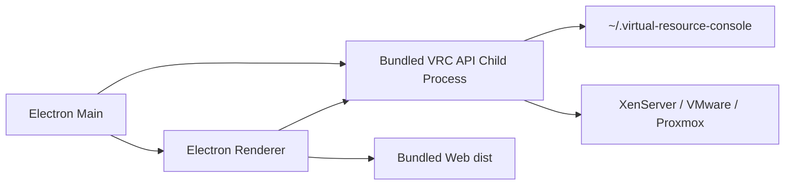

# Virtual Resource Console 分发与打包策略

本文档用于确认 Virtual Resource Console 的功能拆分、运行边界和多形态交付策略。结论先行：核心能力必须沉淀在本地 API / Provider / Provisioning / Console 子系统中，Web UI、Chrome 插件、macOS / Windows 客户端都只是不同入口，不能把平台连接、SSH、XenAPI、安装源发布、任务状态机等能力复制到各端。

## 0. 当前落地口径

截至当前实现，VRC 已按“单端口 Web/API + Electron 桌面壳 + Chrome 插件轻入口”的方向落地：

| 项 | 当前口径 |
|---|---|
| 应用显示名 | 桌面端产品名为 `VRC`，macOS / Windows 可执行应用均使用短名 |
| Web/API 端口 | 开发态仍可用 Vite `5173` + API `3987`；生产态 API 同端口托管 Web dist，用户访问 `http://<host>:3987/` |
| Electron 后端运行时 | 打包版不再使用 Electron 自身 `ELECTRON_RUN_AS_NODE` 跑 API，改为内置官方 Node runtime |
| Node runtime 准备 | `scripts/prepare-electron-runtime.mjs` 在打包前准备 `node-darwin-arm64` 或 `node-win-x64` |
| macOS 布局 | 左侧标题、Logo、设置按钮避让红黄绿窗口按钮；顶栏菜单使用中文 |
| Windows 布局 | 不应用 macOS 红黄绿避让；原生菜单栏直接移除，不显示 `File / Edit / View / Window / Help` |
| Windows 安装器 | NSIS 关闭 `differentialPackage`，产物必须是单个完整 `VRC Setup <version>.exe`，不能要求用户同时携带旁边的 `.7z` 包 |
| 设置入口 | 左侧头部设置齿轮默认隐藏，鼠标悬停或设置页激活时显示 |
| 日志 | Electron 打包版写 `main.log` / `api.log`，Windows 优先写应用同级 `logs/`，无权限时写用户目录 |
| 控制台链路 | noVNC 仍通过本机 API WebSocket 网关；XenServer 控制台增加真实预检、主机 fallback 和 legacy TLS 兼容 |
| Chrome 插件 | 作为轻入口，连接本机或内网 VRC API；连接库只保存在浏览器本地，不承载 Node 后端、SSH、XenAPI 或长任务 |
| 内网部署 | 可只部署 API 服务，API 会同端口托管 Web UI；nginx 不是必须，但可用于 HTTPS、访问控制和反向代理 |

关键命令：

```bash
npm run build
npm run dist:mac
npm run dist:win
npm run build:extension
npm run pack:extension
```

关键产物路径：

```text
apps/electron/dist/VRC-<version>-arm64.dmg
apps/electron/dist/VRC-<version>-arm64-mac.zip
apps/electron/dist/VRC Setup <version>.exe
apps/electron/dist/VRC-<version>-win.zip
apps/chrome-extension/dist/
```

## 1. 当前功能梳理

当前代码按 npm workspace 拆成三部分：

| 模块 | 路径 | 职责 |
|---|---|---|
| Web UI | `apps/web` | Vue 3 + Element Plus 控制台，负责连接管理、资源总览、VM 操作入口、创建 VM 流程、noVNC / Web Console 交互 |
| API / BFF | `apps/api` | Fastify + TypeScript 本地服务，负责 Provider 编排、连接存储、资源清单、Provisioning、安装源发布、控制台网关、IP 租约和运行策略 |
| Electron 壳 | `apps/electron` | 正式桌面分发壳，开发态加载 `VRC_WEB_URL` / Vite，打包态内置 Web dist、API dist 和官方 Node runtime |

核心能力已经集中在 API 侧：

| 能力 | API 落点 | 说明 |
|---|---|---|
| 连接管理 | `connectionStore.ts`, `/api/connections` | 保存平台连接摘要和加密凭据，接口不返回明文密码 |
| Provider 策略 | `providers/provider.ts`, `xenserver.ts`, `vmware.ts`, `proxmox.ts` | 统一 XenServer / VMware / Proxmox 的资源模型 |
| 资源总览 | `/api/inventory/*` | 物理机、VM、磁盘、ISO、指标按接口分层读取 |
| 控制台 | `console/*`, `ConsoleDialog.vue` | XenServer noVNC、VMware / Proxmox 控制台 WebSocket 网关和前端交互 |
| 创建 VM | `provisionTaskStore.ts`, `installSourceService.ts`, `provisioningVerifier.ts` | 任务状态、安装源、IP 租约、网络验证和登录验收 |
| VM 定时开关机 | `vmScheduleStore.ts`, `vmScheduleRunner.ts`, `/api/vm-schedules` | 计划持久化、时区计算、执行租约、错过窗口处理和 Provider 操作编排 |
| 回收分析 | `analysis/reclaimStateMachine.ts` | 输出候选等级和原因，不自动执行回收 |
| 运行策略 | `runtimePolicy.ts`, `config/runtime-policy.example.json` | 本机 IP 识别、口令模板、XenServer 网卡映射 |
| IP 池配置 | `ipPoolPolicy.ts`, `config/ip-pools.example.json` | 默认 DNS、地址池、物理机网段匹配规则和可分配主机号 |

因此，打包和分发策略必须保持：

1. UI 只通过 HTTP / WebSocket 调用 API，不直接 SSH、拼 `xe` 命令或读写平台凭据。
2. Chrome 插件和桌面客户端共用同一套 Web UI 能力，差异放在启动、权限、存储和分发层。
3. Provider、Provisioning、Console、InstallSource 仍在 API 侧演进，避免多端重复实现。
4. 定时任务只能由 API 调度器执行；Web 页面、Electron Renderer 和 Chrome MV3 service worker 只维护任务，禁止各自启动计时器执行 VM 操作。

## 2. 分发形态对比

| 形态 | 定位 | 适合能力 | 不适合能力 | 推荐优先级 |
|---|---|---|---|---|
| 本地 Web + API | 开发和内网部署基线 | 全量功能、调试、内网长时间运行 | 普通用户一键安装体验 | P0 |
| Electron 桌面客户端 | macOS / Windows 主交付形态 | 全量功能、本机凭据、本机 API、控制台、安装源 | 浏览器商店分发 | P1 |
| Chrome 插件 | 伴随入口 / 轻客户端 | 快速打开控制台、连接到本机或远端 VRC API、浏览器侧快捷入口 | 直接运行 SSH / Node API、完整离线能力、后台长任务 | P2 |
| 远端 Web 网关 | 团队共享部署 | 多人访问、统一审计、统一任务中心 | 个人本机密码存储、离线现场 | P3 |

推荐顺序：

1. 本地 Web + API 是所有分发形态的运行基线。
2. Electron 是 macOS / Windows 完整功能客户端，内置 API、Web 静态资源和官方 Node runtime。
3. 如果希望普通用户不安装 CLI，可部署内网服务器，让用户直接访问 `http://<server>:3987/`。
4. Chrome 插件只做薄入口，默认连接本机 `http://127.0.0.1:3987` 或团队部署的 VRC API。
5. 等权限、审计、多人隔离成熟后，再考虑完整远端 Web 网关。

## 2.1 内网服务器策略

如果目标是“用户不装 CLI、打开网页就能用”，应把 VRC 部署成一个内网 HTTP 服务：

```text
浏览器 / Chrome 插件
  -> http://<内网 VRC 服务器>:3987/
  -> 同源 /api/*
  -> VRC API 连接 XenServer / VMware / Proxmox
```

当前落地策略：

1. `npm run build` 构建 `apps/api/dist` 和 `apps/web/dist`。
2. `apps/api` 启动后同端口托管 Web 静态资源。
3. 用户访问 `http://<server>:3987/` 时拿到 Web UI。
4. Web UI 使用相对路径 `/api/*` 调 API，不再需要 Vite `5173`。
5. Chrome 插件只需要配置同一个服务地址。

服务器启动：

```bash
npm install
npm run build
HOST=0.0.0.0 PORT=3987 npm run start:server
```

Docker 启动：

```bash
docker build -t virtual-resource-console .
docker run -d \
  --name vrc \
  -p 3987:3987 \
  -v "$HOME/.virtual-resource-console:/root/.virtual-resource-console" \
  virtual-resource-console
```

### 2.1.1 Chrome 插件内网测试部署

当使用 `192.0.2.26`、`192.0.2.31` 这类内网 VM 作为 Chrome 插件测试服务器时，不需要额外启动 Vite，也不需要 nginx。当前 `192.0.2.26` 实际部署方式是：离线自包含包 + 内置 Node runtime，直接由 VRC API 在 `3988` 端口托管 `/api/*`、Web dist、Chrome CRX 和 `update.xml`。

| 项 | 要求 |
|---|---|
| 系统 | Linux VM，能访问 XenServer / VMware / Proxmox 管理网络 |
| 运行时 | 当前使用随包内置 Node runtime；Docker / Podman 仅作为后续可选方案 |
| 端口 | 对测试用户开放一个 HTTP 端口，推荐先用 `3988` 验证，稳定后再切 `3987` |
| 持久目录 | 当前 root 进程使用 `/root/.virtual-resource-console`；如果后续要统一到 `/opt/vrc/data`，需要先在代码中支持数据目录配置或用受控用户运行 |
| 浏览器插件 | 开发验证加载 `apps/chrome-extension/dist`；免开发者模式走 Chrome 企业策略 + 自托管 CRX |

当前探测口径和实际状态：

```text
192.0.2.26:22    可连接
192.0.2.26:3987  端口开放，但 /api/health 返回空响应，不像 VRC API
192.0.2.31:22    可连接
192.0.2.31:3987  端口开放，但 /api/health 返回空响应，不像 VRC API
192.0.2.26 nginx  systemctl is-active nginx 返回 unknown；无 nginx 进程
192.0.2.26:3988  runtime/node/bin/node apps/api/dist/index.js 正在监听
```

因此测试部署不建议直接覆盖现有 `3987` 进程。当前 `2.26` 先用 `3988` 跑 VRC API，并由 API 同端口托管 Web、Chrome 插件 CRX 和 `update.xml`。

当前 `192.0.2.26` 实测部署状态：

```text
部署方式：离线自包含包，不依赖 Docker / yum / 服务器 npm install
运行地址：http://192.0.2.26:3988/
健康检查：http://192.0.2.26:3988/api/health
应用目录：/opt/vrc/app
数据目录：/root/.virtual-resource-console
运行服务：systemd vrc-api.service
运行进程：runtime/node/bin/node apps/api/dist/index.js
监听端口：0.0.0.0:3988
nginx 状态：未安装/未运行；当前没有 nginx 反代
服务单元：/etc/systemd/system/vrc-api.service（仓库模板 config/vrc-api.service）
运行日志：journalctl -u vrc-api.service；历史 nohup 日志保留在 /opt/vrc/app/logs/
Chrome 自托管目录：/opt/vrc/app/apps/web/dist/chrome-extension
Chrome update URL：http://192.0.2.26:3988/chrome-extension/update.xml
Chrome CRX URL：http://192.0.2.26:3988/chrome-extension/virtual-resource-console-extension-0.1.1.crx
Chrome 开发者模式 zip：http://192.0.2.26:3988/chrome-extension/virtual-resource-console-extension-0.1.3.zip
Windows 下载目录：http://192.0.2.26:3988/downloads/windows/
```

服务管理口径：

```bash
systemctl status vrc-api.service
systemctl restart vrc-api.service
systemctl enable vrc-api.service
journalctl -u vrc-api.service -n 100 --no-pager
```

`vrc-api.service` 使用 `Restart=always`，进程异常退出后由 systemd 自动拉起，服务器重启后随 `multi-user.target` 启动。

部署新版 Web/API 时，需要同时覆盖：

```text
/opt/vrc/app/apps/api/dist
/opt/vrc/app/apps/web/dist
```

如果修改了静态资源 MIME，例如 `.crx` / `.xml`，必须重启 Node API 服务，因为 MIME 逻辑在 `apps/api/dist/index.js` 中。

Chrome 插件开发验证步骤：

1. 本地执行 `npm run pack:extension`，生成 `release/virtual-resource-console-extension.zip` 和带版本号的 zip，同时刷新 `apps/chrome-extension/dist/`。
2. Chrome 打开 `chrome://extensions/`，开启开发者模式。
3. 选择 `Load unpacked`，目录选 `apps/chrome-extension/dist`；如果拿到的是 zip，先解压再选择解压后的目录。
4. 打开插件设置页，服务地址填 `http://192.0.2.26:3988` 或 `http://192.0.2.31:3988`。
5. 点击“检测服务”，应返回 `virtual-resource-console-api`。
6. 在“本地连接库”录入测试服务器连接，连接信息只进入当前浏览器 `chrome.storage.local`；打开控制台或读取资源时，浏览器只提交本次调用所需连接参数，且包含账号密码的请求必须先做应用层加密。

当前 `2.26` 已托管开发者模式 zip 下载：

```text
http://192.0.2.26:3988/chrome-extension/virtual-resource-console-extension-0.1.3.zip
```

由于该 VM 是 CentOS 7、glibc 2.17，且无 Docker / Podman / 系统 Node / npm、yum 无外网 DNS，当前测试部署随包内置 `node-v20.19.5-linux-x64-glibc-217` 运行时。systemd 只负责守护这个内置 Node 进程，不提供运行时，也不要求额外安装 Node。

切换到正式端口时，先确认现有 `3987` 进程可停止，再修改 `vrc-api.service` 中的 `Environment=PORT=3988` 并执行：

```bash
systemctl daemon-reload
systemctl restart vrc-api.service
curl http://127.0.0.1:3987/api/health
```

如果后续服务器补齐 Docker / Podman，可以改成容器托管；但容器只是部署形态，不改变 VRC API 必须常驻运行、Chrome 插件只配置服务地址的边界。

服务器部署注意事项：

1. VRC 服务器必须能访问目标 XenServer / VMware / Proxmox 管理网络。
2. XenServer 无人值守安装由目标物理机在 VM 网段发布任务级安装源，不依赖 VRC 客户端地址。
3. 首版仍是本地/内网工具口径，生产多人使用前需要补用户登录、权限隔离和审计。
4. 本机模式的连接凭据和 runtime policy 保存在本机 `~/.virtual-resource-console/`，不要打进镜像或提交仓库；共享 Web 模式禁止把用户连接凭据保存到服务器。
5. 内网跨人使用时，建议先放在受控网段或 VPN 内，前面加反向代理和访问控制。

### 2.1.2 共享 Web 连接与加密边界

共享 Web 的安全边界不是“前端隐藏连接”，而是服务端不能拥有用户连接源。

| 项 | 本机 Web / Electron | 共享 Web / Chrome 插件 |
|---|---|---|
| 连接库 | 可读用户本机 `~/.virtual-resource-console/connections.json` | 只读浏览器本地 `localStorage` / `chrome.storage.local` |
| 服务端保存账号 | 允许本机个人使用 | 禁止 |
| 服务端临时账号会话 | 可作为本机辅助能力 | 禁止 |
| `connectionId` 语义 | 可由 API 解析到本机保存连接 | 只能是浏览器本地 ID，不能交给 API 找密码 |
| 含密码请求 | 建议加密 | 必须应用层加密 |

无 HTTPS / 无证书时，不能依赖传输层保护账号密码。VRC 采用应用层信封加密：

1. API 首次启动生成请求加密密钥对，只保存通信私钥，不保存虚拟化平台账号。
2. 浏览器请求 `/api/crypto/public-key` 获取公钥、`keyId` 和 fingerprint。
3. 浏览器本地锁定 fingerprint；指纹变化时阻断敏感请求，要求用户确认。
4. 只要 JSON payload 含 `password`、`rootPassword` 或嵌套敏感字段，就用 AES-GCM 加密完整 JSON，再用 RSA-OAEP 加密 AES key。
5. API 在请求生命周期内解密 body，进入原有 zod 校验和业务逻辑；账号密码不落盘、不进入连接清单、不保存为服务端 session。

实现要求：

- 不能直接依赖浏览器 `crypto.subtle`。`http://192.168.2.26:3988` 这类非 localhost 的 HTTP 页面不是安全上下文，Chrome 不暴露 WebCrypto subtle；Web UI 必须保留纯 JS 加密兜底。
- 验证共享 Web 时不能只测 `/api/health` 和首屏加载，必须在真实 Chrome 的 HTTP 地址上触发一次含密码请求，确认没有 `Cannot read properties of undefined (reading 'generateKey')` 这类浏览器运行时错误。

没有 HTTPS 时，这套加密能防止被动抓包看到明文密码；首次信任公钥仍需要 TOFU 或人工确认 fingerprint，不能把自动下载的公钥天然视为可信身份。

### 2.1.3 共享 Web 控制台策略

共享 Web 模式下，控制台不能依赖服务端保存连接库。浏览器本地连接只在本次请求中提交，API 只负责短期控制台会话和 WebSocket 转发：

1. Web UI 根据浏览器本地连接生成直连 payload，并通过应用层加密提交到 `/api/console/<provider>/session`。
2. API 解密后立即向 XenServer / VMware / Proxmox 申请控制台 ticket 或控制台 URL。
3. API 生成 60 秒短会话 `sessionId`，返回 `wsPath`；PVE 额外返回 noVNC password。
4. 前端 noVNC 只连接 `wsPath`，不把账号密码放到 URL；PVE password 通过 noVNC credentials 传入。
5. WebSocket 建连后短会话即消费，不允许作为服务端连接库复用。

当前平台链路：

| 平台 | 控制台准备接口 | WebSocket 网关 | 说明 |
|---|---|---|---|
| XenServer | `/api/console/xenserver/session` | `/api/console/xenserver?sessionId=...` | 通过 XenAPI 查 console location，支持主机 fallback 和 legacy TLS 兼容 |
| VMware | `/api/console/vmware/session` | `/api/console/vmware?sessionId=...` | 通过 SOAP 获取 WebMKS ticket，前端仍统一用 VRC 控制台弹框 |
| Proxmox VE | `/api/console/proxmox/session` | `/api/console/proxmox?sessionId=...` | 通过 PVE `vncproxy` + `vncwebsocket`，password 交给 noVNC credentials |

验证共享 Web 控制台时，不能只看 `/api/health`。最低验证口径：

1. `/api/connections` 在共享 Web 模式返回空数组，确认服务端没有暴露保存连接。
2. 使用浏览器本地连接触发一次含密码的加密请求，确认 HTTP 内网环境不会因为 `crypto.subtle` 不存在失败。
3. 加载物理机和 VM 列表，确认 IP、系统、磁盘等字段正常显示。
4. 点击运行中 VM 名称打开控制台，确认弹框出现“已连接”，且没有“未找到接口”。
5. 对 XenServer / VMware / Proxmox 分别做 session + WebSocket smoke test；PVE 测试时不要把 password 当作 WebSocket subprotocol，应该按 noVNC credentials 处理。

2026-07-17 对 `http://192.168.2.26:3988/` 的实测结论：

| 项 | 结果 |
|---|---|
| 健康检查 | `/api/health` 正常，`persistentEnabled=false`，原因是 `shared-web` |
| 服务端连接列表 | `/api/connections` 返回 `[]` |
| PVE 2.20 | 连接测试、物理机、VM 列表、控制台 session、控制台 WS 和 UI 弹框均通过 |
| VMware 2.17 | 连接测试、物理机、VM 列表、控制台 session、控制台 WS 和 UI 弹框均通过 |
| XenServer 2.12 | 连接测试、物理机、VM 列表、控制台 session 和控制台 WS 通过；UI 列表通过，弹框 UI 需在稳定浏览器会话中复测 |
| PVE 129.2 | 本机到 `192.168.129.2:8006` 可达，但 2.26 API 代连超时；按服务器到 129 网段路由问题排查 |

## 2.2 定时任务执行策略

三种交付形态共用 `~/.virtual-resource-console/vm-schedules.json` 任务模型和同一组 `/api/vm-schedules` 接口，但执行进程按运行形态区分：

| 使用方式 | 任务维护入口 | 实际执行者 | 生命周期要求 |
|---|---|---|---|
| Web / 内网部署 | 同源 Web UI | 常驻 VRC API，`VRC_RUNTIME_MODE=web` | API 应交给 launchd/systemd/Docker 等守护；关闭浏览器不影响执行 |
| Electron 客户端 | 内置 Web UI | Electron 拉起或复用的 VRC API，`VRC_RUNTIME_MODE=electron` | 关闭窗口只隐藏到托盘，API 继续运行；明确“退出”才停止本机执行器 |
| Chrome 插件 | 插件打开的本机或远端 Web UI | 配置地址对应的远端 API，或 Native Host 拉起的本机 API，`VRC_RUNTIME_MODE=chrome-native` | 插件 popup、Chrome 标签页和 MV3 service worker 都不执行定时任务 |

执行安全规则：

1. 同一用户目录只允许一个 API 实例持有 `vm-schedule-runner.lock` 执行租约；Web、Electron、Native Host 同时启动时，其余实例只提供 CRUD 接口，禁止重复触发同一计划。
2. 任务触发前先在持久化文件中推进 `nextRunAt`，再调用 Provider；进程中途异常不能重复执行同一轮。
3. API 停止超过 5 分钟导致错过执行窗口时，本轮标记为跳过并计算下一次时间，禁止恢复服务后补执行过期关机任务。
4. 单次、每天、每周计划都按任务保存的 IANA 时区计算；浏览器时区只负责展示，不参与触发。
5. Chrome 插件只能检测和启动 API，不能使用 `chrome.alarms`、service worker 或 Native Messaging 直接持有凭据和执行 VM 操作。
6. Electron 如果检测到 `127.0.0.1:3987` 已有健康 VRC API，应复用该服务；只有没有可复用服务时才启动内置 API，减少同机多实例。
7. 跨物理机计划的每个目标都保存自己的 `connectionId / providerType / hostId`，执行器按“连接 + 物理机”分组读取和执行；一个连接失败只影响该组 VM，不中断其他物理机。
8. VM 冲突、去重、覆盖旧计划必须使用 `connectionId + vmId` 联合标识，不能假设不同虚拟化平台的 VM ID 全局唯一。
9. `GET /api/vm-schedule-targets` 只读取已持久化连接，目录结果在 API 内缓存 5 分钟并在服务启动后预热；缓存过期时先返回旧目录并后台刷新，避免每次打开弹框重新扫描全部平台。

## 2.3 nginx 边界

nginx 不是 VRC 的运行时依赖，单独 nginx 也不能替代 VRC API。部署时的职责划分如下：

| 组件 | 是否必须 | 职责 |
|---|---|---|
| VRC API | 必须 | 提供 `/api/*`、WebSocket 控制台、Provider 连接、任务编排，并托管 Web dist |
| Node runtime | 必须 | 运行 `apps/api/dist/index.js` |
| nginx | 可选 | HTTPS 终止、访问控制、域名反向代理、静态缓存策略 |
| 数据库 | 当前非必须 | 当前连接、任务和策略仍以本地文件/内存状态为主，后续多人化再补持久化 |

最小部署只需要：

```bash
HOST=0.0.0.0 PORT=3987 npm run start:server
```

nginx 反代示例：

```nginx
server {
  listen 443 ssl;
  server_name vrc.example.local;

  location / {
    proxy_pass http://127.0.0.1:3987;
    proxy_http_version 1.1;
    proxy_set_header Host $host;
    proxy_set_header X-Forwarded-Proto $scheme;
    proxy_set_header X-Forwarded-For $proxy_add_x_forwarded_for;
  }

  location /api/console/ {
    proxy_pass http://127.0.0.1:3987;
    proxy_http_version 1.1;
    proxy_set_header Upgrade $http_upgrade;
    proxy_set_header Connection "upgrade";
    proxy_set_header Host $host;
  }
}
```

如果只是内网临时使用，可以先不加 nginx；如果要团队共享、HTTPS、权限入口或统一域名，再加 nginx 或网关。

## 3. Chrome 插件策略

### 3.1 定位

Chrome 插件不能作为完整后端替代。Manifest V3 的 service worker 不适合长期运行 SSH、XenAPI、ISO 生成、安装源发布、noVNC 网关或 Provisioning 任务。插件应定位为：

1. 浏览器工具栏入口，快速打开 VRC 控制台。
2. 可选侧边栏 / popup，用于查看连接摘要、近期任务、快捷打开 VM 控制台。
3. 连接本机 VRC API 或远端 VRC API 的轻客户端。
4. 可复用 Web UI 的一部分页面，但需要适配扩展环境的路由和 CSP。

当前已落地最小插件：

| 文件 | 说明 |
|---|---|
| `apps/chrome-extension/src/manifest.json` | Manifest V3 配置 |
| `apps/chrome-extension/src/popup.html` | 工具栏弹窗 |
| `apps/chrome-extension/src/options.html` | 插件设置页 |
| `apps/chrome-extension/src/popup.js` | 保存服务地址、检测健康、启动本机服务、打开控制台 |
| `apps/chrome-extension/src/popup.css` | 紧凑运维入口样式 |

当前插件展示名使用短名 `VRC`，打包产物由 `apps/chrome-extension/src` 复制到 `apps/chrome-extension/dist`，再压缩为 `release/virtual-resource-console-extension.zip`。

打包：

```bash
npm run build:extension
npm run pack:extension
```

本机自动启动：

```bash
npm run install:native-host
```

Native Host 使用 Chrome 标准 Native Messaging 机制，host 名称为 `com.virtualresource.console`。Native Host 的 `allowed_origins` 必须与实际分发渠道的扩展 ID 对齐：

| 分发渠道 | 扩展 ID | 用途 |
|---|---|---|
| 开发者模式加载 `apps/chrome-extension/dist` | 由 Chrome 依据 manifest key 或临时加载目录决定 | 本地开发调试 |
| 企业策略自托管 CRX | `hiljahiejjbfbhalfoohiajfikhngfml` | 内网免开发者模式安装 |

如果后续要让企业策略版也调用 Native Host，必须把 `scripts/install-chrome-native-host-macos.mjs` 和 Windows Native Messaging Host 注册表中的 `allowed_origins` 同步为 `chrome-extension://hiljahiejjbfbhalfoohiajfikhngfml/`。

自动启动顺序：

1. 插件先访问配置地址的 `/api/health`。
2. 如果不可用，点击“启动本机服务”会调用 Native Host。
3. Native Host 在本机启动 `npm run start:server`，默认地址为 `http://127.0.0.1:3987`。
4. 如果 Native Host 不存在，插件退回到 `vrc://start`，用于唤起已安装的 Electron 客户端。
5. 如果本机链路不可用，继续使用内网服务器地址。

开发调试：

1. 打开 Chrome `chrome://extensions/`。
2. 开启 Developer mode。
3. Load unpacked 选择 `apps/chrome-extension/dist`。
4. 在插件里填写内网服务地址，例如 `http://vrc-server:3987`。
5. 点击“检测服务”，确认 `/api/health` 可用。

### 3.1.1 企业策略自托管安装

普通 Chrome 不允许直接拖拽自签名 `.crx` 安装，会报 `CRX_REQUIRED_PROOF_MISSING`。如果不走 Chrome Web Store，又不希望用户开启开发者模式，应使用 Chrome Enterprise Policy 自托管安装。

当前自托管产物：

```text
release/chrome-enterprise/virtual-resource-console-extension-0.1.1.crx
release/chrome-enterprise/update.xml
release/chrome-enterprise/install-vrc-chrome-policy.reg
release/chrome-enterprise/remove-vrc-chrome-policy.reg
release/virtual-resource-console-extension-0.1.1.pem
```

`release/virtual-resource-console-extension-0.1.1.pem` 是 CRX 私钥，只用于后续升级保持插件 ID 不变，不得发给普通用户，不得提交到公开仓库。

当前企业策略版固定信息：

```text
扩展 ID：hiljahiejjbfbhalfoohiajfikhngfml
Update URL：http://192.0.2.26:3988/chrome-extension/update.xml
CRX URL：http://192.0.2.26:3988/chrome-extension/virtual-resource-console-extension-0.1.1.crx
```

`update.xml` 格式：

```xml
<?xml version="1.0" encoding="UTF-8"?>
<gupdate xmlns="http://www.google.com/update2/response" protocol="2.0">
  <app appid="hiljahiejjbfbhalfoohiajfikhngfml">
    <updatecheck codebase="http://192.0.2.26:3988/chrome-extension/virtual-resource-console-extension-0.1.1.crx" version="0.1.1" />
  </app>
</gupdate>
```

Windows 策略注册表：

```reg
Windows Registry Editor Version 5.00

[HKEY_LOCAL_MACHINE\SOFTWARE\Policies\Google\Chrome\ExtensionInstallForcelist]
"1"="hiljahiejjbfbhalfoohiajfikhngfml;http://192.0.2.26:3988/chrome-extension/update.xml"
```

Windows 用户侧安装步骤：

1. 先删除开发者模式加载的 VRC 插件，避免两个版本并存。
2. 以管理员身份导入 `install-vrc-chrome-policy.reg`。
3. 重启 Chrome，或打开 `chrome://policy` 点击「重新加载政策」。
4. 打开 `chrome://extensions`，确认 VRC 显示为策略安装。

撤销策略：

1. 以管理员身份导入 `remove-vrc-chrome-policy.reg`，或删除 `ExtensionInstallForcelist` 对应键值。
2. 重启 Chrome，或在 `chrome://policy` 重新加载政策。

服务端托管要求：

| 路径 | MIME |
|---|---|
| `/chrome-extension/update.xml` | `application/xml; charset=utf-8` |
| `/chrome-extension/*.crx` | `application/x-chrome-extension` |

当前 VRC API 的静态资源兜底路由已经在 `apps/api/src/index.ts` 中补齐 `.xml` 和 `.crx` MIME。如果改由 nginx 托管，需要同步配置：

```nginx
types {
  application/xml xml;
  application/x-chrome-extension crx;
}
```

### 3.2 目标架构


当前最小插件只保存 API 地址、展示偏好和临时 UI 状态。后续如果要求“平台连接信息只留在浏览器本地”，需要启用私密连接模式：插件本地加密保存连接信息，VRC API 只接收加密后的本次业务请求，不接收长期或临时连接会话。

### 3.3 代码形态

当前 workspace：

```text
apps/chrome-extension/
  package.json
  dist/
  src/
    manifest.json
    popup.html
    popup.js
    popup.css
    options.html
```

后续可复用方式：

1. 抽出 `apps/web/src/domain` 中的纯前端策略为可共享模块，供 Web UI 和插件 UI 使用。
2. API 调用层封装成 `@vrc/client`，统一处理 base URL、HTTP、WebSocket、错误提示。
3. 插件 UI 不直接复用整个 `App.vue`，先复用小范围组件或构建独立 popup / side panel，避免一次性适配完整控制台布局。

### 3.4 Manifest V3 要点

插件需要：

```json
{
  "manifest_version": 3,
  "name": "VRC",
  "short_name": "VRC",
  "permissions": ["storage", "tabs", "nativeMessaging"],
  "host_permissions": [
    "http://*/*",
    "https://*/*"
  ],
  "action": {
    "default_title": "VRC",
    "default_popup": "popup.html"
  },
  "options_page": "options.html"
}
```

注意事项：

1. 当前允许用户配置任意本机或内网 VRC API 地址，因此 host permissions 使用 `http://*/*`、`https://*/*`；上架 Chrome Web Store 前可改为更严格的 optional host permissions。
2. `nativeMessaging` 仅用于本机 Native Host 启动 VRC API；没有安装 Native Host 时退回 `vrc://start` 或内网服务器地址。
3. 如果没有 HTTPS / 证书，包含账号密码的请求必须走 VRC 应用层加密；本机模式允许 `127.0.0.1`。
4. noVNC 页面如果放在插件页面内，需要确认 WebSocket、CSP 和资源路径兼容。
5. 插件不能绕过后端确认令牌执行开关机、删除、创建 VM 等变更操作。
6. Chrome Web Store 分发前需要补隐私说明，明确插件是否保存平台连接信息、是否本地加密、是否上传到 VRC API。

### 3.5 插件打包命令

根 `package.json` 当前已提供：

```json
{
  "scripts": {
    "build:extension": "npm --workspace apps/chrome-extension run build",
    "pack:extension": "npm run build:extension && node scripts/pack-chrome-extension.mjs"
  }
}
```

打包产物应为：

```text
apps/chrome-extension/dist/
release/virtual-resource-console-extension.zip
release/virtual-resource-console-extension-<version>.zip
release/chrome-enterprise/virtual-resource-console-extension-<version>.crx
release/chrome-enterprise/update.xml
release/chrome-enterprise/install-vrc-chrome-policy.reg
```

普通 zip 只用于开发者模式加载前的归档，Chrome 不能直接安装 zip。`.crx` 不用于普通拖拽安装，必须配合 Chrome 企业策略或 Chrome Web Store 分发。

### 3.6 私密连接模式

如果插件需要录入服务器连接信息，并且连接信息不能上传到共享后台，应按以下模式落地：

该模式只属于 Chrome 插件配置项，不替代 Web、macOS、Windows 的运行方式。Web 页面继续作为 VRC API 的主界面；macOS / Windows 继续由 Electron 客户端内置 API、Web dist 和 Node runtime；Chrome 插件只保存浏览器侧入口地址和本地密文连接。

```text
Chrome 插件
  保存：VRC API 地址、平台连接信息密文
  存储：chrome.storage.local
  加密：用户主密码 -> WebCrypto PBKDF2 / AES-GCM

VRC API
  保存：请求加密公钥/私钥
  不保存：平台账号、密码、连接清单、临时连接会话
```

接口边界：

```text
GET /api/crypto/public-key
  输出：publicKey、keyId、fingerprint
  存储：API 本地通信私钥，不存平台账号

POST /api/inventory/*
POST /api/provisioning/*
POST /api/console/*
  输入：加密信封；解密后只在本次请求内使用连接参数
  禁止：共享 Web 下传 connectionId 让 API 解析服务端账号
```

落地要求：

1. 插件配置页必须支持填写后端服务地址和端口。
2. 平台连接信息默认只存 `chrome.storage.local`，不能存 `chrome.storage.sync`。
3. 浏览器本地保存的连接信息必须加密，不能明文保存密码。
4. VRC API 只在一次请求生命周期内使用凭据，不能写入 `~/.virtual-resource-console/connection-store`，也不能创建服务端临时连接会话。
5. 共享内网后台在没有用户系统前，不能保存团队成员的平台连接信息。
6. 如需要后台长期保存每个人的连接信息，必须先补用户、权限、审计和连接隔离。
7. 无证书 HTTP 部署时，浏览器必须校验并锁定 API 公钥 fingerprint；指纹变化时阻断敏感请求并要求用户确认。

原型文件：

```text
docs/ui-prototypes/vrc-chrome-extension-private-connections.html
```

## 4. 桌面客户端策略

### 4.1 结论

桌面端优先使用 Electron，不建议当前阶段切换 Tauri。原因：

1. 仓库已有 `apps/electron`，迁移成本低。
2. API 是 Node / TypeScript，Electron 可以直接内置或拉起 Node 后端。
3. noVNC、WebSocket、文件上传和本地运行策略与现有 Web UI 兼容度高。
4. macOS / Windows 打包、签名、自动更新生态成熟。

Tauri 可以作为后续轻量化评估项，但不作为第一版交付策略。

### 4.2 目标架构



桌面客户端应内置：

1. `apps/web/dist` 静态资源。
2. `apps/api/dist` 后端代码。
3. 启动脚本或 Electron main 进程拉起 API 子进程。
4. 运行时数据仍写入 `~/.virtual-resource-console/`，不写进应用包。

### 4.3 当前 Electron 落地方式

Electron 已作为正式桌面壳落地，核心实现点如下：

1. 打包前先执行根 `npm run build`，生成 `apps/api/dist` 和 `apps/web/dist`。
2. `apps/electron/main.cjs` 在打包模式下启动本地 API 子进程，等待 `/api/health` 可用后加载本机服务地址。
3. API 在打包模式下通过 `VRC_WEB_DIST_DIR` 指向内置 `web` 目录，同端口托管 Web 静态资源。
4. 默认 API 端口为 `3987`；如果该端口已有健康 VRC API，Electron 直接复用；如果被其他程序占用才选择空闲本机端口。
5. 关闭主窗口只隐藏到系统托盘，内置 API 和定时任务执行器继续运行；从托盘或应用菜单明确退出时才关闭 API 子进程。
6. 打包版 API 子进程使用内置官方 Node runtime，避免 Electron/BoringSSL 与系统 Node TLS 行为不一致。
7. 日志通过 Electron 主进程管道写入文件，便于定位 API 启动、控制台和 TLS 问题。

根脚本：

```json
{
  "scripts": {
    "build": "npm --workspace apps/api run build && npm --workspace apps/web run build",
    "pack:electron": "npm run build && npm --workspace apps/electron run pack",
    "dist:mac": "npm run build && npm --workspace apps/electron run dist:mac",
    "dist:win": "npm run build && npm --workspace apps/electron run dist:win"
  }
}
```

`apps/electron/package.json` 当前关键配置：

```json
{
  "scripts": {
    "dev": "electron .",
    "pack": "electron-builder --dir",
    "predist:mac": "node ../../scripts/prepare-electron-runtime.mjs darwin-arm64",
    "dist:mac": "electron-builder --mac",
    "predist:win": "node ../../scripts/prepare-electron-runtime.mjs win-x64",
    "dist:win": "electron-builder --win --x64"
  },
  "build": {
    "appId": "com.virtualresource.console",
    "productName": "VRC",
    "files": [
      "main.cjs",
      "assets/**",
      "package.json"
    ],
    "extraResources": [
      {
        "from": "../api/dist",
        "to": "api"
      },
      {
        "from": "../web/dist",
        "to": "web"
      },
      {
        "from": ".runtime",
        "to": "runtime",
        "filter": ["node-*/**/*"]
      }
    ]
  }
}
```

打包前置脚本只保留当前目标平台的 Node runtime，避免 macOS 的 `npm/npx/corepack` 符号链接混入 Windows zip，导致 7zip 扫描失败。

```text
macOS:   resources/runtime/node-darwin-arm64/bin/node
Windows: resources/runtime/node-win-x64/node.exe
```

日志中 `starting bundled api` 会记录：

```json
{
  "nodeRuntime": ".../resources/runtime/node-*/...",
  "useElectronAsNode": false
}
```

正常打包版应为 `useElectronAsNode:false`。如果为 `true`，说明内置 Node runtime 缺失，API 退回到 Electron 运行时。

### 4.4 macOS 分发

macOS 打包目标：

| 场景 | 产物 | 要求 |
|---|---|---|
| 内部测试 | `.app` / `.zip` | 可先不签名，但 Gatekeeper 会提示风险 |
| 团队分发 | `.dmg` | Developer ID 签名，建议 notarize |
| 正式交付 | `.dmg` + auto update | 签名、公证、版本号递增、更新通道 |

验证清单：

1. 清理 `apps/web/dist`、Vite 缓存和 Electron 构建缓存。
2. 执行桌面打包。
3. 安装到 `/Applications/VRC.app`。
4. 确认应用版本号、API 子进程、Web UI、控制台 WebSocket、连接存储路径都正常。
5. 如修改标题栏或样式，需要实际打开应用检查 macOS 红黄绿按钮避让和拖拽区域。

macOS 当前 UI 约束：

1. 应用显示名使用 `VRC`，菜单中使用中文项，例如 `关于 VRC`、`文件`、`编辑`、`视图`、`窗口`、`帮助`。
2. `BrowserWindow` 使用 `titleBarStyle: "hiddenInset"`，红黄绿按钮位置由 `trafficLightPosition` 控制。
3. 前端只在 `electron-mac-shell` 下启用标题栏避让：左侧标题、Logo、设置按钮下移，避免覆盖红黄绿。
4. 顶部拖拽区域只在 macOS Electron 下渲染，Windows 不渲染该拖拽层。

安装验证命令：

```bash
pkill -f "/Applications/VRC.app|VRC.app/Contents/MacOS/VRC" 2>/dev/null || true
rm -rf /Applications/VRC.app
cp -R apps/electron/dist/mac-arm64/VRC.app /Applications/
open /Applications/VRC.app
defaults read /Applications/VRC.app/Contents/Info.plist CFBundleShortVersionString
ps -axo pid,command | grep -E '/Applications/VRC\\.app' | grep -v grep
```

### 4.5 Windows 分发

Windows 打包目标：

| 场景 | 产物 | 要求 |
|---|---|---|
| 内部测试 | portable `.zip` | 可快速解压运行 |
| 内部测试 / 安装包异常兜底 | portable `.exe` | 单文件运行，不写入开始菜单和卸载项 |
| 普通安装 | NSIS `.exe` | 安装目录、卸载、开始菜单 |
| 企业分发 | MSI | 需要额外打包链路或企业软件分发系统 |

注意事项：

1. Windows 需要验证 API 子进程路径、空格路径和中文用户名路径。
2. 防火墙可能拦截本机 API 监听，需要尽量绑定 `127.0.0.1`。
3. WebSocket 控制台、文件上传、ISO 生成目录要在 Windows 环境实测。
4. 正式分发建议做代码签名，降低 SmartScreen 提示。

Windows 当前 UI 约束：

1. 应用显示名使用 `VRC`，可执行文件为 `VRC.exe`。
2. Windows 不应用 macOS 红黄绿避让样式，前端类名为 `electron-windows-shell`。
3. Windows 原生菜单栏通过 `Menu.setApplicationMenu(null)` 移除，不显示 `File / Edit / View / Window / Help`，也不占顶部高度。
4. 左侧设置齿轮默认隐藏，鼠标移到左侧头部或设置页激活时显示。
5. NSIS 安装包名称为 `VRC Setup <version>.exe`，zip 便携包名称为 `VRC-<version>-win.zip`。

Windows 打包产物：

```text
apps/electron/dist/VRC Setup <version>.exe
apps/electron/dist/VRC <version>.exe
apps/electron/dist/VRC-<version>-win.zip
apps/electron/dist/win-unpacked/VRC.exe
```

Windows 当前建议分发顺序：

1. 优先试 `VRC <version>.exe` portable 单文件，验证目标系统是否能启动 Electron 38。
2. 如果目标系统运行正常，再使用 `VRC Setup <version>.exe` 安装包做开始菜单和桌面快捷方式。
3. 如果安装包卡在“正在安装”，先确认是否已有旧 VRC 进程、杀毒软件拦截、安装目录权限问题；同时用 zip/portable 作为临时交付。
4. 如果目标机器是 Windows 7 / Windows Server 2008 R2，Electron 38 不支持，即使安装包成功也可能无法启动，需要单独维护低 Electron 版本的 legacy Windows 包。

zip 便携包内的 `Start Virtual Resource Console.cmd` 必须指向 `VRC.exe`，不能再使用旧名称 `Virtual Resource Console.exe`。

Windows 日志路径：

1. zip 解压版或可写安装目录：`<VRC.exe 所在目录>/logs/main.log`、`api.log`。
2. 安装目录不可写时：`%APPDATA%/VRC/logs/` 或 Electron userData 对应目录。
3. 托盘菜单提供“打开日志目录”。

### 4.6 控制台与 TLS 兼容

XenServer 控制台问题的当前结论：

1. 浏览器开发态正常、打包态异常时，优先核对 API 子进程运行时。
2. 打包版必须使用内置官方 Node runtime，不使用 Electron 自身 `ELECTRON_RUN_AS_NODE` 跑 API。
3. 如果日志或前端显示 `OPENSSL ... UNSUPPORTED_PROTOCOL`，通常表示目标 XenServer TLS 协议较老。
4. XenServer 控制台链路已增加真实预检接口 `/api/console/xenserver/preflight`。
5. XenServer 控制台地址 hostname 不可解析时，会尝试 XenServer 返回的 console host 和用户配置的 host/IP。
6. XenAPI 登录和 console tunnel 按“现代 TLS -> legacy TLS -> 明文 fallback”的顺序尝试。

legacy TLS 兼容参数：

```text
minVersion: TLSv1
ciphers: DEFAULT@SECLEVEL=0
```

排障顺序：

1. 查看前端控制台状态文本；文本被截断时鼠标悬停可看完整错误。
2. 查看 `api.log` 中的 `xenserver console preflight failed`、`xenserver console tunnel host failed`。
3. 确认日志里 `useElectronAsNode:false`。
4. 确认 VRC 所在机器能访问 XenServer 管理 IP、console 返回 host、443 或 fallback 端口。

### 4.7 安装源发布口径

XenServer 无人值守安装源不依赖当前 Web/Electron 应用服务地址。当前口径是：

1. VRC API 编排创建任务。
2. 对 XenServer 创建链路，任务级安装源发布在目标 XenServer 宿主机侧。
3. 宿主机侧安装源默认根目录为 `/var/run/vrc-install-source`。
4. 宿主机侧端口默认从 `3988` 开始，端口池大小默认 `20`。

相关环境变量：

```text
VRC_XEN_HOST_INSTALL_SOURCE_PORT=3988
VRC_XEN_HOST_INSTALL_SOURCE_PORT_COUNT=20
VRC_XEN_HOST_INSTALL_SOURCE_ROOT=/var/run/vrc-install-source
```

文档和部署说明中不要再把该链路误写成 `VRC_INSTALL_SOURCE_BASE_URL` 由当前应用服务直接对 VM 提供安装源。保留的 `/api/provisioning/install-source/*` 路由只是兼容已有调用，XenServer 创建链路使用目标物理机任务级安装源。

## 5. 版本与配置策略

所有形态共用同一套版本号，建议根包和各 workspace 同步：

```text
virtual-resource-console 0.1.x
@vrc/api 0.1.x
@vrc/web 0.1.x
@vrc/electron 0.1.x
@vrc/chrome-extension 0.1.x
```

配置分层：

| 配置 | 保存位置 | 说明 |
|---|---|---|
| 平台连接和加密凭据 | `~/.virtual-resource-console/` | API 管理，插件和 UI 不直接读写 |
| runtime policy | `~/.virtual-resource-console/runtime-policy.json` | 现场运行识别策略，不进仓库 |
| IP pools | `~/.virtual-resource-console/ip-pools.json` | 现场 IP 池配置，不进仓库 |
| 插件 API 地址 | `chrome.storage.local` | 只保存 VRC API base URL |
| 桌面 API 端口 | Electron 运行时注入 | 端口冲突时可动态分配 |
| 远端部署地址 | 环境变量或部署配置 | 不写入前端源码 |

配置路径规则：`VRC_IP_POOLS_FILE` 指定完整文件路径时优先；否则读取 `${VRC_DATA_DIR:-~/.virtual-resource-console}/ip-pools.json`。runtime policy 同样遵循 `VRC_RUNTIME_POLICY_FILE` 优先、否则读取 `${VRC_DATA_DIR:-~/.virtual-resource-console}/runtime-policy.json`。

IP pools 是强制配置：运行时只读取 `ip-pools.json`，不读取旧 `providerIpPools`，文件缺失或格式不正确必须报错。仓库里的 `config/ip-pools.json` 是默认 IP 池模板，当前维护 129 / 2 / 127 三个网段；其中 2 网段网关为 `192.168.2.254`，127 网段网关为 `192.168.127.254`。`config/ip-pools.example.json` 只作为脱敏示例。桌面客户端和服务端运行时都以数据目录文件为准，不在升级时覆盖用户已经维护过的 `${VRC_DATA_DIR:-$HOME/.virtual-resource-console}/ip-pools.json`。API 加载 IP 池时保留用户导入值，不静默改写；创建 XenServer 无人值守任务时再按当前环境规则校验网关，不满足时拒绝创建并提示用户到设置页修正。

落地规则：

1. `VRC_IP_POOLS_FILE` 指定完整文件路径时优先。
2. 未指定时读取 `${VRC_DATA_DIR:-$HOME/.virtual-resource-console}/ip-pools.json`。
3. `scripts/start-local.sh` 只在目标文件不存在时，把 `config/ip-pools.json` 写入数据目录一次。
4. 服务器部署需要显式放置或更新数据目录里的 `ip-pools.json`，不能依赖 API 静默兜底。
5. 用户在设置页导入或保存后，只修改数据目录文件，不反写仓库模板。
6. Electron 安装包不携带真实连接清单、runtime policy、日志或用户数据；IP 池以后续数据目录文件为准。

## 6. 安全边界

1. 默认查询、读取、状态检查和清单导出。
2. 创建 VM、开关机、删除、挂载 ISO、修改资源配置等变更仍必须经过 UI 确认和后端校验。
3. Chrome 插件不得保存平台密码，不得直接执行平台命令。
4. 桌面端不得把密码写入命令行参数、日志或崩溃报告。
5. 分发包不得包含真实连接清单、runtime policy、日志、ISO 缓存或任务数据。
6. Electron 打包产物只包含目标平台 Node runtime，例如 macOS 只带 `node-darwin-*`、Windows 只带 `node-win-*`。
7. 所有分发包需要排除 `~/.virtual-resource-console/`、日志、真实配置、无关平台 runtime、`node_modules` 中无关缓存和构建临时文件。

## 7. 落地路线与剩余事项

### 阶段 1：整理 Web / API 基线

当前状态：

1. `npm run build` 已作为桌面端、服务端和插件分发的共同前置命令。
2. API 已同端口托管 Web dist，生产态不再要求用户同时启动 Vite 和 API 两个端口。
3. `/api/health`、连接管理、清单、控制台、Provisioning 任务接口已经作为 Web、Electron、Chrome 插件共同入口。

待补齐：

1. 继续沉淀 API 契约说明，减少 Web、Electron、插件各自理解接口。
2. 如后续插件和 Web 复用更多业务逻辑，再抽 `@vrc/client` 或共享前端 client 包。
3. 多人远端部署前补用户、权限、审计和连接隔离。

### 阶段 2：Electron 正式客户端

当前状态：

1. Electron 内置 Web dist 和 API dist。
2. 支持 macOS `.dmg` / `.zip`，Windows NSIS / `.zip`。
3. 完成应用启动、退出、端口冲突、日志路径、版本号验证。
4. 打包版使用内置官方 Node runtime 启动 API，避免 Electron 运行时 TLS 差异。
5. macOS 和 Windows 的标题栏、菜单、设置入口采用不同 UI 约束，避免互相影响。

当前产出：

```text
apps/electron/package.json build 配置
scripts/prepare-electron-runtime.mjs
apps/electron/dist/VRC-<version>-arm64.dmg
apps/electron/dist/VRC-<version>-arm64-mac.zip
apps/electron/dist/VRC Setup <version>.exe
apps/electron/dist/VRC-<version>-win.zip
```

待补齐：

1. 正式分发前补 macOS Developer ID 签名和 notarize。
2. Windows 正式分发前补代码签名，降低 SmartScreen 提示。
3. 自动更新通道暂不作为当前首要目标，先保证离线安装包和 zip 便携包稳定。

### 阶段 3：Chrome 插件薄入口

当前状态：

1. 已新增 `apps/chrome-extension`。
2. popup / options 支持配置 API 地址、检测 `/api/health`、打开控制台。
3. 支持 Native Messaging 调用本机 Native Host 启动 VRC API。
4. Native Host 不存在时退回 `vrc://start`，用于唤起已安装的 Electron 客户端。
5. 插件仍是轻入口，不承载 Node 后端、SSH、XenAPI、安装源发布或长任务。

当前产出：

```text
apps/chrome-extension/dist
release/virtual-resource-console-extension.zip
```

待补齐：

```text
Chrome Web Store 隐私说明草案
```

如需在插件内嵌 noVNC，需要单独验证 Manifest V3 CSP、WebSocket、资源路径和焦点捕获，不作为当前最小插件入口的前置条件。

### 阶段 4：远端团队部署

当前状态：

1. 可将 VRC API 部署到内网服务器，API 同端口托管 Web UI。
2. 用户可直接访问 `http://<server>:3987/`，无需安装 CLI。
3. Chrome 插件可配置内网服务器地址，作为浏览器快捷入口。
4. nginx 可选，只用于 HTTPS、域名、访问控制和反向代理，不能替代 VRC API。

待补齐：

1. API 增加用户、权限、审计、连接隔离。
2. Chrome 插件和 Web UI 支持连接远端内网 HTTP API；包含账号密码的请求必须走应用层加密。
3. runtime policy、任务状态的持久化和备份策略。
4. 安装源仍按当前 XenServer 宿主机任务级发布口径处理，不回退到 `VRC_INSTALL_SOURCE_BASE_URL`。

## 8. 策略确认

当前建议确认如下策略：

1. 核心能力不做多端复制，统一留在 `apps/api`。
2. Web UI 是所有交付形态的共享主界面。
3. 桌面客户端是完整功能主交付形态，优先 Electron，目标 macOS / Windows。
4. Chrome 插件是轻量入口，不承载 SSH、Provider、Provisioning 后端。
5. 打包顺序先桌面、后插件；插件依赖稳定的本机或远端 VRC API。
6. 所有变更操作继续遵守只读默认、确认令牌、任务状态和审计边界。
