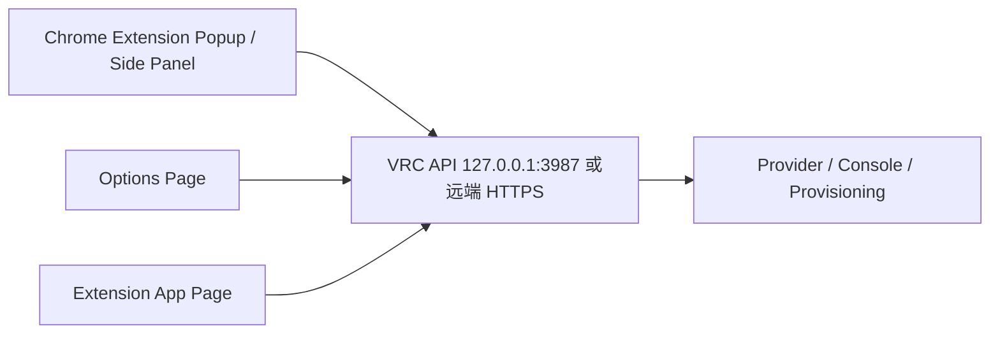
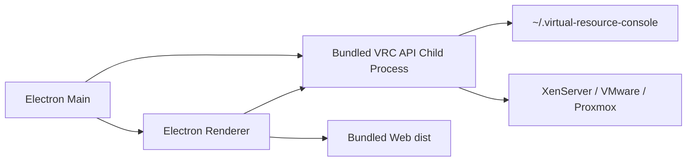

# Virtual Resource Console 分发与打包策略

本文档用于确认 Virtual Resource Console 的功能拆分、运行边界和多形态交付策略。结论先行：核心能力必须沉淀在本地 API / Provider / Provisioning / Console 子系统中，Web UI、Chrome 插件、macOS / Windows 客户端都只是不同入口，不能把平台连接、SSH、XenAPI、安装源发布、任务状态机等能力复制到各端。

## 1. 当前功能梳理

当前代码按 npm workspace 拆成三部分：

| 模块 | 路径 | 职责 |
|---|---|---|
| Web UI | `apps/web` | Vue 3 + Element Plus 控制台，负责连接管理、资源总览、VM 操作入口、创建 VM 流程、noVNC / Web Console 交互 |
| API / BFF | `apps/api` | Fastify + TypeScript 本地服务，负责 Provider 编排、连接存储、资源清单、Provisioning、安装源发布、控制台网关、IP 租约和运行策略 |
| Electron 壳 | `apps/electron` | 当前为开发态桌面窗口，加载 `VRC_WEB_URL` 或本地 Vite 页面，后续应升级为正式桌面分发壳 |

核心能力已经集中在 API 侧：

| 能力 | API 落点 | 说明 |
|---|---|---|
| 连接管理 | `connectionStore.ts`, `/api/connections` | 保存平台连接摘要和加密凭据，接口不返回明文密码 |
| Provider 策略 | `providers/provider.ts`, `xenserver.ts`, `vmware.ts`, `proxmox.ts` | 统一 XenServer / VMware / Proxmox 的资源模型 |
| 资源总览 | `/api/inventory/*` | 物理机、VM、磁盘、ISO、指标按接口分层读取 |
| 控制台 | `console/*`, `ConsoleDialog.vue` | XenServer noVNC、VMware / Proxmox 控制台 WebSocket 网关和前端交互 |
| 创建 VM | `provisionTaskStore.ts`, `installSourceService.ts`, `provisioningVerifier.ts` | 任务状态、安装源、IP 租约、网络验证和登录验收 |
| 回收分析 | `analysis/reclaimStateMachine.ts` | 输出候选等级和原因，不自动执行回收 |
| 运行策略 | `runtimePolicy.ts`, `config/runtime-policy.example.json` | 本机网段、DNS、IP 池、口令模板、XenServer 网卡映射 |

因此，后续打包策略必须保持：

1. UI 只通过 HTTP / WebSocket 调用 API，不直接 SSH、拼 `xe` 命令或读写平台凭据。
2. Chrome 插件和桌面客户端共用同一套 Web UI 能力，差异放在启动、权限、存储和分发层。
3. Provider、Provisioning、Console、InstallSource 仍在 API 侧演进，避免多端重复实现。

## 2. 分发形态对比

| 形态 | 定位 | 适合能力 | 不适合能力 | 推荐优先级 |
|---|---|---|---|---|
| 本地 Web + API | 开发和内网部署基线 | 全量功能、调试、内网长时间运行 | 普通用户一键安装体验 | P0 |
| Electron 桌面客户端 | macOS / Windows 主交付形态 | 全量功能、本机凭据、本机 API、控制台、安装源 | 浏览器商店分发 | P1 |
| Chrome 插件 | 伴随入口 / 轻客户端 | 快速打开控制台、连接到本机或远端 VRC API、浏览器侧快捷入口 | 直接运行 SSH / Node API、完整离线能力、后台长任务 | P2 |
| 远端 Web 网关 | 团队共享部署 | 多人访问、统一审计、统一任务中心 | 个人本机密码存储、离线现场 | P3 |

推荐顺序：

1. 先稳住本地 Web + API，作为所有分发形态的运行基线。
2. 如果希望普通用户不安装 CLI，优先部署内网服务器，让用户直接访问 `http://<server>:3987/`。
3. Chrome 插件只做薄入口，默认连接本机 `http://127.0.0.1:3987` 或团队部署的 VRC API。
4. 再把 Electron 做成正式 macOS / Windows 客户端，客户端内置 API 和 Web 静态资源，作为离线现场交付形态。
5. 等权限、审计、多人隔离成熟后，再考虑完整远端 Web 网关。

## 2.1 内网服务器策略

如果目标是“用户不装 CLI、打开网页就能用”，应把 VRC 部署成一个内网 HTTP 服务：

```text
浏览器 / Chrome 插件
  -> http://<内网 VRC 服务器>:3987/
  -> 同源 /api/*
  -> VRC API 连接 XenServer / VMware / Proxmox
```

当前落地策略：

1. `npm run build` 构建 `apps/api/dist` 和 `apps/web/dist`。
2. `apps/api` 启动后同端口托管 Web 静态资源。
3. 用户访问 `http://<server>:3987/` 时拿到 Web UI。
4. Web UI 使用相对路径 `/api/*` 调 API，不再需要 Vite `5173`。
5. Chrome 插件只需要配置同一个服务地址。

服务器启动：

```bash
npm install
npm run build
HOST=0.0.0.0 PORT=3987 npm run start:server
```

Docker 启动：

```bash
docker build -t virtual-resource-console .
docker run -d \
  --name vrc \
  -p 3987:3987 \
  -v "$HOME/.virtual-resource-console:/root/.virtual-resource-console" \
  virtual-resource-console
```

服务器部署注意事项：

1. VRC 服务器必须能访问目标 XenServer / VMware / Proxmox 管理网络。
2. XenServer 无人值守安装由目标物理机在 VM 网段发布任务级安装源，不依赖 VRC 客户端地址。
3. 首版仍是本地/内网工具口径，生产多人使用前需要补用户登录、权限隔离和审计。
4. 连接凭据和 runtime policy 保存在服务器的 `~/.virtual-resource-console/`，不要打进镜像或提交仓库。
5. 内网跨人使用时，建议先放在受控网段或 VPN 内，前面加反向代理和访问控制。

## 3. Chrome 插件策略

### 3.1 定位

Chrome 插件不能作为完整后端替代。Manifest V3 的 service worker 不适合长期运行 SSH、XenAPI、ISO 生成、安装源发布、noVNC 网关或 Provisioning 任务。插件应定位为：

1. 浏览器工具栏入口，快速打开 VRC 控制台。
2. 可选侧边栏 / popup，用于查看连接摘要、近期任务、快捷打开 VM 控制台。
3. 连接本机 VRC API 或远端 VRC API 的轻客户端。
4. 可复用 Web UI 的一部分页面，但需要适配扩展环境的路由和 CSP。

当前已落地最小插件：

| 文件 | 说明 |
|---|---|
| `apps/chrome-extension/src/manifest.json` | Manifest V3 配置 |
| `apps/chrome-extension/src/popup.html` | 工具栏弹窗 |
| `apps/chrome-extension/src/options.html` | 插件设置页 |
| `apps/chrome-extension/src/popup.js` | 保存服务地址、检测健康、启动本机服务、打开控制台 |
| `apps/chrome-extension/src/popup.css` | 紧凑运维入口样式 |

打包：

```bash
npm run build:extension
npm run pack:extension
```

本机自动启动：

```bash
npm run install:native-host
```

Native Host 使用 Chrome 标准 Native Messaging 机制，host 名称为 `com.virtualresource.console`。插件固定扩展 ID 为 `nmnnabfmhipigdohpkigkafkchimnfih`，用于 Native Host 的 `allowed_origins` 授权。

自动启动顺序：

1. 插件先访问配置地址的 `/api/health`。
2. 如果不可用，点击“启动本机服务”会调用 Native Host。
3. Native Host 在本机启动 `npm run start:server`，默认地址为 `http://127.0.0.1:3987`。
4. 如果 Native Host 不存在，插件退回到 `vrc://start`，用于唤起已安装的 Electron 客户端。
5. 如果本机链路不可用，继续使用内网服务器地址。

开发调试：

1. 打开 Chrome `chrome://extensions/`。
2. 开启 Developer mode。
3. Load unpacked 选择 `apps/chrome-extension/dist`。
4. 在插件里填写内网服务地址，例如 `http://vrc-server:3987`。
5. 点击“检测服务”，确认 `/api/health` 可用。

### 3.2 目标架构



插件只保存 API 地址、展示偏好和临时 UI 状态。平台账号、密码、IP 池、安装源策略仍由 VRC API 保存和校验。

### 3.3 代码形态

建议新增 workspace：

```text
apps/chrome-extension/
  package.json
  manifest.json
  src/
    background.ts
    popup/
    options/
    app/
```

可复用方式：

1. 抽出 `apps/web/src/domain` 中的纯前端策略为可共享模块，供 Web UI 和插件 UI 使用。
2. API 调用层封装成 `@vrc/client`，统一处理 base URL、HTTP、WebSocket、错误提示。
3. 插件 UI 不直接复用整个 `App.vue`，先复用小范围组件或构建独立 popup / side panel，避免一次性适配完整控制台布局。

### 3.4 Manifest V3 要点

插件需要：

```json
{
  "manifest_version": 3,
  "permissions": ["storage", "sidePanel"],
  "host_permissions": [
    "http://127.0.0.1:3987/*",
    "http://localhost:3987/*",
    "https://*/api/*"
  ],
  "background": {
    "service_worker": "background.js",
    "type": "module"
  },
  "action": {
    "default_popup": "popup.html"
  },
  "options_page": "options.html"
}
```

注意事项：

1. 生产环境优先使用 HTTPS 远端 API；本机模式允许 `127.0.0.1`。
2. noVNC 页面如果放在插件页面内，需要确认 WebSocket、CSP 和资源路径兼容。
3. 插件不能绕过后端确认令牌执行开关机、删除、创建 VM 等变更操作。
4. Chrome Web Store 分发前需要补隐私说明，明确插件不采集平台密码，凭据只在 VRC API 本地存储。

### 3.5 插件打包命令

后续可在根 `package.json` 增加：

```json
{
  "scripts": {
    "build:extension": "npm --workspace apps/chrome-extension run build",
    "pack:extension": "npm run build:extension && node scripts/pack-chrome-extension.mjs"
  }
}
```

打包产物应为：

```text
apps/chrome-extension/dist/
release/virtual-resource-console-extension.zip
```

## 4. 桌面客户端策略

### 4.1 结论

桌面端优先使用 Electron，不建议当前阶段切换 Tauri。原因：

1. 仓库已有 `apps/electron`，迁移成本低。
2. API 是 Node / TypeScript，Electron 可以直接内置或拉起 Node 后端。
3. noVNC、WebSocket、文件上传和本地运行策略与现有 Web UI 兼容度高。
4. macOS / Windows 打包、签名、自动更新生态成熟。

Tauri 可以作为后续轻量化评估项，但不作为第一版交付策略。

### 4.2 目标架构



桌面客户端应内置：

1. `apps/web/dist` 静态资源。
2. `apps/api/dist` 后端代码。
3. 启动脚本或 Electron main 进程拉起 API 子进程。
4. 运行时数据仍写入 `~/.virtual-resource-console/`，不写进应用包。

### 4.3 必要改造

当前 `apps/electron/main.cjs` 只加载开发地址，正式打包前需要补：

1. 生产环境加载 `apps/web/dist/index.html` 或内置静态服务。
2. Electron 启动时拉起 API 子进程，并等待 `/api/health` 可用。
3. 应用退出时关闭 API 子进程。
4. API 端口冲突处理：默认 `3987`，冲突时自动选择空闲端口并通过 preload / query 注入给前端。
5. 增加 preload，暴露只读的运行信息，例如平台、API base URL、版本号。
6. 增加 `electron-builder` 或 `electron-forge` 打包配置。

推荐使用 `electron-builder`，根脚本示例：

```json
{
  "scripts": {
    "build": "npm --workspace apps/api run build && npm --workspace apps/web run build",
    "pack:desktop": "npm run build && npm --workspace apps/electron run pack",
    "dist:mac": "npm run build && npm --workspace apps/electron run dist:mac",
    "dist:win": "npm run build && npm --workspace apps/electron run dist:win"
  }
}
```

`apps/electron/package.json` 后续示例：

```json
{
  "scripts": {
    "dev": "electron .",
    "pack": "electron-builder --dir",
    "dist:mac": "electron-builder --mac dmg,zip",
    "dist:win": "electron-builder --win nsis,zip"
  },
  "build": {
    "appId": "com.virtualresource.console",
    "productName": "Virtual Resource Console",
    "files": [
      "main.cjs",
      "preload.cjs",
      "package.json"
    ],
    "extraResources": [
      {
        "from": "../web/dist",
        "to": "web"
      },
      {
        "from": "../api/dist",
        "to": "api"
      }
    ]
  }
}
```

实际落地时需要按 workspace 路径验证 `extraResources`，避免打包时出现 `file source doesn't exist`。

### 4.4 macOS 分发

macOS 打包目标：

| 场景 | 产物 | 要求 |
|---|---|---|
| 内部测试 | `.app` / `.zip` | 可先不签名，但 Gatekeeper 会提示风险 |
| 团队分发 | `.dmg` | Developer ID 签名，建议 notarize |
| 正式交付 | `.dmg` + auto update | 签名、公证、版本号递增、更新通道 |

验证清单：

1. 清理 `apps/web/dist`、Vite 缓存和 Electron 构建缓存。
2. 执行桌面打包。
3. 安装到 `/Applications`。
4. 确认应用版本号、API 子进程、Web UI、控制台 WebSocket、连接存储路径都正常。
5. 如修改标题栏或样式，需要实际打开应用检查 macOS 红黄绿按钮避让和拖拽区域。

### 4.5 Windows 分发

Windows 打包目标：

| 场景 | 产物 | 要求 |
|---|---|---|
| 内部测试 | portable `.zip` | 可快速解压运行 |
| 普通安装 | NSIS `.exe` | 安装目录、卸载、开始菜单 |
| 企业分发 | MSI | 需要额外打包链路或企业软件分发系统 |

注意事项：

1. Windows 需要验证 API 子进程路径、空格路径和中文用户名路径。
2. 防火墙可能拦截本机 API 监听，需要尽量绑定 `127.0.0.1`。
3. WebSocket 控制台、文件上传、ISO 生成目录要在 Windows 环境实测。
4. 正式分发建议做代码签名，降低 SmartScreen 提示。

## 5. 版本与配置策略

所有形态共用同一套版本号，建议根包和各 workspace 同步：

```text
virtual-resource-console 0.1.x
@vrc/api 0.1.x
@vrc/web 0.1.x
@vrc/electron 0.1.x
@vrc/chrome-extension 0.1.x
```

配置分层：

| 配置 | 保存位置 | 说明 |
|---|---|---|
| 平台连接和加密凭据 | `~/.virtual-resource-console/` | API 管理，插件和 UI 不直接读写 |
| runtime policy | `~/.virtual-resource-console/runtime-policy.json` | 现场部署策略，不进仓库 |
| 插件 API 地址 | `chrome.storage.local` | 只保存 VRC API base URL |
| 桌面 API 端口 | Electron 运行时注入 | 端口冲突时可动态分配 |
| 远端部署地址 | 环境变量或部署配置 | 不写入前端源码 |

## 6. 安全边界

1. 默认查询、读取、状态检查和清单导出。
2. 创建 VM、开关机、删除、挂载 ISO、修改资源配置等变更仍必须经过 UI 确认和后端校验。
3. Chrome 插件不得保存平台密码，不得直接执行平台命令。
4. 桌面端不得把密码写入命令行参数、日志或崩溃报告。
5. 分发包不得包含真实连接清单、runtime policy、日志、ISO 缓存或任务数据。
6. 所有打包产物需要排除 `.runtime/`、`~/.virtual-resource-console/`、`node_modules` 中无关缓存和构建临时文件。

## 7. 落地路线

### 阶段 1：整理 Web / API 基线

目标：

1. 保证 `npm run typecheck`、`npm run build` 稳定。
2. 抽出 API client，避免 Web、Electron、插件各自拼 fetch。
3. 固化 `/api/health`、连接管理、清单、控制台、Provisioning 任务接口契约。

产出：

```text
packages/client 或 apps/web/src/apiClient.ts
docs/API契约说明.md
```

### 阶段 2：Electron 正式客户端

目标：

1. Electron 内置 Web dist 和 API dist。
2. 支持 macOS `.dmg` / `.zip`，Windows NSIS / `.zip`。
3. 完成应用启动、退出、端口冲突、日志路径、版本号验证。

产出：

```text
apps/electron/preload.cjs
apps/electron/package.json build 配置
scripts/pack-desktop.mjs
release/mac/*
release/win/*
```

### 阶段 3：Chrome 插件薄入口

目标：

1. 新增 `apps/chrome-extension`。
2. popup / side panel 支持配置 API 地址、查看连接摘要、打开主控制台。
3. 如需内嵌 noVNC，单独验证扩展 CSP 和 WebSocket。

产出：

```text
apps/chrome-extension/dist
release/virtual-resource-console-extension.zip
Chrome Web Store 隐私说明草案
```

### 阶段 4：远端团队部署

目标：

1. API 增加用户、权限、审计、连接隔离。
2. 安装源地址使用稳定内网域名。
3. Chrome 插件和 Web UI 默认连接远端 HTTPS API。

## 8. 策略确认

当前建议确认如下策略：

1. 核心能力不做多端复制，统一留在 `apps/api`。
2. Web UI 是所有交付形态的共享主界面。
3. 桌面客户端是完整功能主交付形态，优先 Electron，目标 macOS / Windows。
4. Chrome 插件是轻量入口，不承载 SSH、Provider、Provisioning 后端。
5. 打包顺序先桌面、后插件；插件依赖稳定的本机或远端 VRC API。
6. 所有变更操作继续遵守只读默认、确认令牌、任务状态和审计边界。
